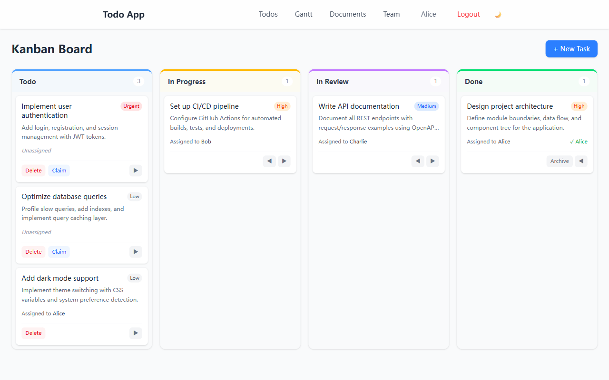
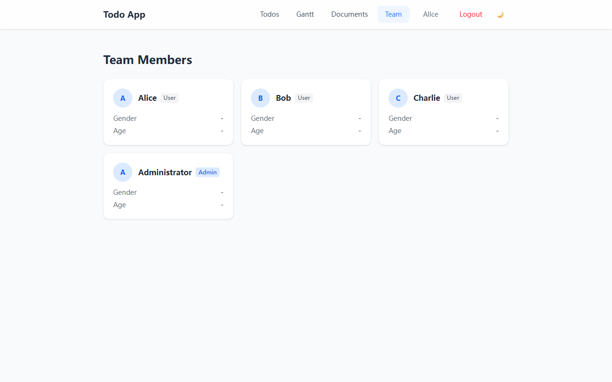

# Todo List — 全栈看板应用

基于 Dioxus 0.7 构建的全栈（Fullstack）任务管理应用，支持看板视图、甘特图、团队协作和 Markdown 文档编辑。

## 功能特性

- **看板视图** — 拖拽任务卡片在 "待办 / 进行中 / 审查中 / 已完成" 四列之间流转
- **甘特图** — 按时间线可视化任务排期
- **团队管理** — 成员目录，支持认领和分配任务
- **Markdown 文档** — 类 Notion 的文档编辑器，支持表格、任务列表、删除线
- **用户系统** — 注册 / 登录，JWT 鉴权，个人资料编辑
- **暗色模式** — 一键切换，偏好持久化到 localStorage

## 截图

### 看板视图



### 团队管理



## 技术栈

| 层 | 技术 |
| --- | --- |
| 前端 | Dioxus 0.7 (WASM) + Tailwind CSS |
| 后端 | Axum 0.8 (Dioxus Fullstack) |
| 数据库 | SQLite (sqlx 0.8) |
| 鉴权 | Argon2id 密码哈希 + JWT (HS256) |
| Markdown | pulldown-cmark |

## 本地开发

### 前置要求

- Rust 1.85+
- wasm32-unknown-unknown target

```bash
rustup target add wasm32-unknown-unknown
```

### 安装 Dioxus CLI

```bash
cargo install dioxus-cli --version 0.7.1
```

### 启动开发服务器

```bash
dx serve --platform web
```

浏览器打开 `http://localhost:8080` 即可。

首次启动会自动创建 `todo_list.db` 数据库并填充种子数据：

- 3 个用户：Alice / Bob / Charlie（密码均为 `password123`）
- 6 个示例任务

## Docker 一键部署

适用于 Linux 服务器的傻瓜式部署，内置 Nginx 反向代理。

### 1. 克隆代码

```bash
git clone <your-repo-url> && cd todo_list
```

### 2. 配置 JWT 密钥

```bash
echo "JWT_SECRET=$(openssl rand -base64 32)" > .env
```

### 3. 启动

```bash
docker compose up -d --build
```

首次构建约 10-15 分钟，后续增量构建会复用缓存。

### 4. 访问

浏览器打开 `http://<服务器IP>`，开始使用。

### 日常运维

```bash
# 查看日志
docker compose logs -f

# 重启服务
docker compose restart

# 停止服务
docker compose down

# 备份数据库（SQLite 就是单个文件）
cp data/todo_list.db data/backup-$(date +%Y%m%d).db
```

### 环境变量

| 变量 | 说明 | 默认值 |
| --- | --- | --- |
| `JWT_SECRET` | JWT 签名密钥 | 硬编码默认值（生产环境务必修改） |
| `DB_PATH` | SQLite 数据库文件路径 | `./todo_list.db` |

### 架构

```text
浏览器 (:80)  →  Nginx  →  Dioxus Server (:8080, 容器内部)
                               ├── Axum HTTP 服务
                               ├── WASM 客户端分发
                               └── SQLite (./data/todo_list.db)
```

## 项目结构

```text
src/
├── main.rs              # 路由定义、App 入口、暗色模式上下文
├── models.rs            # Task, User, Document 等数据模型
├── backend.rs           # 服务端函数 (API 端点)
├── auth.rs              # AuthSession 提取器、JWT 客户端工具
├── server/
│   ├── mod.rs           # 服务端模块导出
│   ├── db.rs            # SQLite 连接池、迁移、种子数据
│   └── auth.rs          # Argon2 哈希、JWT 签发/验证
├── views/
│   ├── navbar.rs        # 导航栏布局 + 暗色模式切换
│   ├── todos.rs         # 看板主页
│   ├── gantt.rs         # 甘特图页
│   ├── documents.rs     # Markdown 文档编辑器
│   ├── team.rs          # 团队成员目录
│   ├── profile.rs       # 个人资料编辑
│   ├── login.rs         # 登录表单
│   ├── register.rs      # 注册表单
│   ├── require_auth.rs  # 路由鉴权守卫
│   └── page_not_found.rs
└── components/
    ├── kanban_column.rs # 看板列组件
    ├── task_card.rs     # 任务卡片组件
    └── task_form.rs     # 新建任务表单
```
